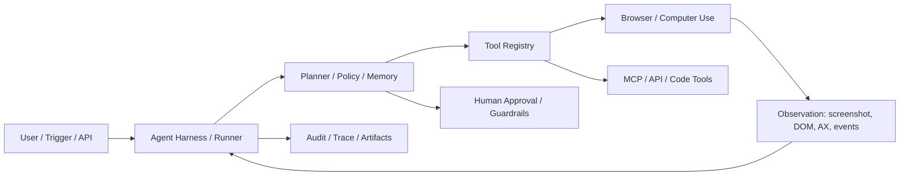
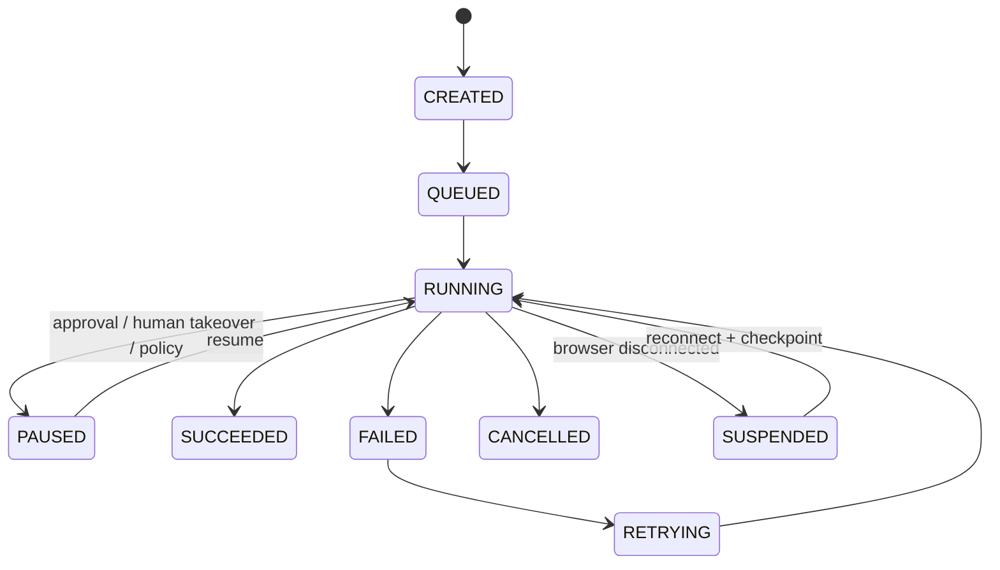
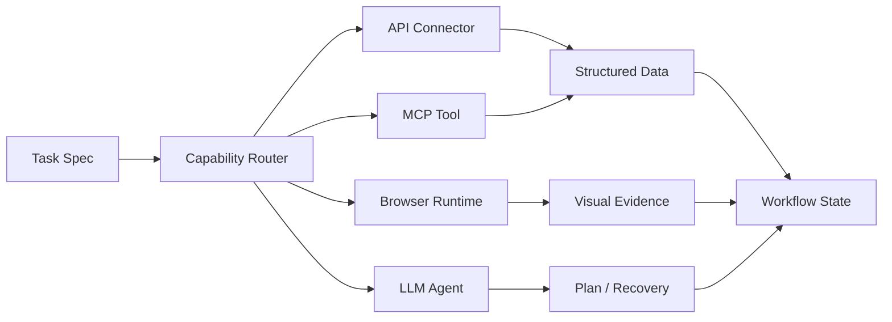
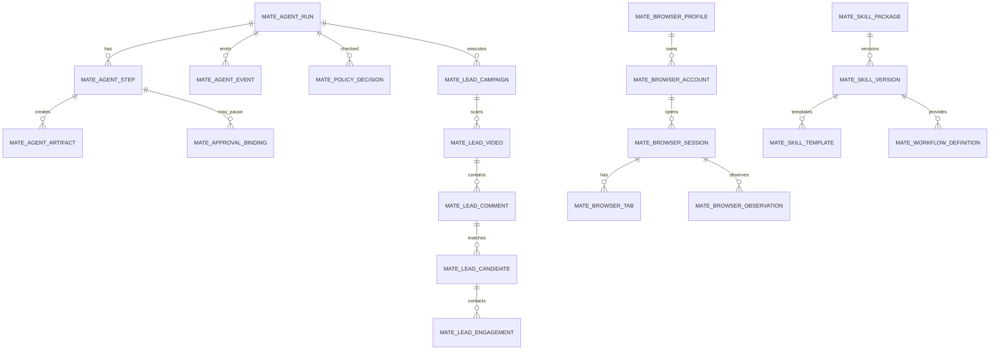
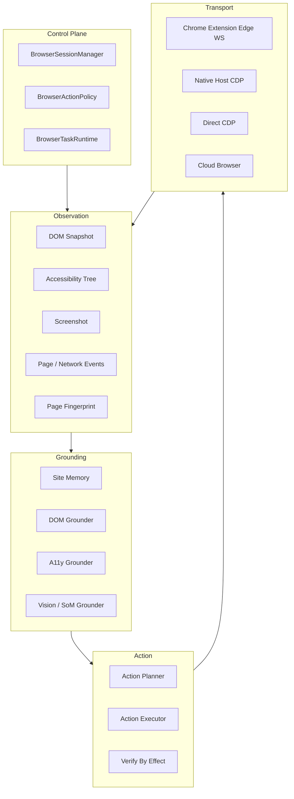

# MateClaw Agent OS - 下一代 Browser Agent 平台架构设计

日期：2026-06-04

范围：

- 当前 MateClaw 项目：`D:\devfive\mateclaw`
- browser-use：`D:\ai_work\browser-use-main`
- browser-harness：`D:\ai_work\browser-harness`

本设计不以历史代码兼容和最小改动为目标，而以最终工业级效果为目标。抖音获客只是 V1 验证场景，最终产品定位是：

> MateClaw Agent OS = 通用 Browser Agent 平台 + Skill Marketplace + Workflow Engine + 多执行通道。

最终推荐方案：

> 保留 MateClaw 现有 StateGraph、Skill、MCP、Workflow、Tool Guard、Browser Edge 的基础能力，但新增一个独立的 Durable Run Kernel，并将浏览器业务流程从巨型 harness 重构为 `Workflow + Skill DSL + Browser Domain Adapter`。通用 Agent 负责探索和异常恢复，Skill Agent 负责高频稳定流程。浏览器层使用结构化 DOM/A11y/截图多模态观察和 verified action，不让大模型每一步临场猜。

---

## 文档目录

1. 当前项目分析报告
2. browser-use 分析报告
3. browser-harness 分析报告
4. 行业竞品分析报告
5. MateClaw Agent OS 总体架构设计
6. 数据库设计
7. Workflow Engine 设计
8. Skill DSL 设计
9. 浏览器控制层设计
10. V1-V4 演进路线图
11. 重点问题最终回答

---

## 1. 当前项目分析报告

### 1.1 当前 MateClaw 架构现状

当前 MateClaw 已经具备 Agent OS 的雏形：

| 能力 | 当前位置 | 现状 |
|---|---|---|
| Agent Runtime | `mateclaw-server/src/main/java/vip/mate/agent/graph/` | `StateGraphReActAgent`、`StateGraphPlanExecuteAgent` 已成型 |
| Tool System | `vip/mate/tool/` | Built-in tools、Tool Guard、Tool disclosure 已有 |
| Browser Edge | `vip/mate/browser/edge/`、`vip/mate/browser/orchestrator/` | Control Plane、Edge Protocol、DOM/A11y/Vision grounding 已有 |
| Skill | `vip/mate/skill/` | SKILL.md、manifest、script wrapper、MCP/ACP virtual skill 已有 |
| MCP | `vip/mate/tool/mcp/` | MCP 生命周期和 per-agent binding 已有 |
| Workflow | `vip/mate/workflow/` | JSON DSL、run/step/pause、approval、dispatch、memory step 已有 |
| Trigger/Scheduler | `vip/mate/trigger/`、`vip/mate/cron/` | Cron、webhook、channel trigger、dedup、rate limit 已有 |
| Approval | `vip/mate/approval/` | Tool Guard approval、channel card 已有 |
| Memory | `vip/mate/memory/`、`vip/mate/wiki/` | 结构化记忆、事实查询、Wiki 检索已有 |
| LLM Provider | `vip/mate/llm/` | Provider-agnostic、failover、模型能力管理已有 |

关键现状：

- `StateGraphReActAgent` 是认知循环，不适合直接承担长期任务持久化。
- `WorkflowRunner` 是业务流程执行器，但还缺浏览器步骤、loop、skill invoke、checkpoint 等工业级运行原语。
- `ExtensionBrowserTool` 已经有真实浏览器 primitives。
- `LeadBrowserHarnessTool` 证明抖音获客 V1 能跑，但它是业务逻辑巨型工具，不应成为长期平台核心。

### 1.2 当前核心问题

| 问题 | 具体表现 | 架构根因 |
|---|---|---|
| 浏览器链路不稳定 | 评论区、筛选、tab、DM 反复失败 | LLM 每步拼工具，缺稳定状态机和 postcondition |
| 业务逻辑硬编码 | 抖音逻辑集中在 `LeadBrowserHarnessTool` | 缺 Platform Adapter 和 Skill DSL |
| 任务不可恢复 | 长任务断线后依赖 agent 记忆 | 缺 durable run checkpoint |
| 成功判断不可信 | 有时报告完成但页面未完成 | 缺 verify-by-effect 统一协议 |
| 多账号不足 | 当前 Browser session 默认 subject | 缺 BrowserProfile/BrowserAccount 一等模型 |
| 数据分析困难 | 评论、视频、关注、私信未形成统一事实表 | 缺 Run/Lead/Engagement 数据模型 |
| Skill 扩展受限 | Skill 更偏 prompt/code/MCP，不够表达浏览器域流程 | 缺 domain-browser skill 类型 |
| 观测不足 | 失败原因依赖工具返回长 JSON | 缺 step event、截图、DOM snapshot、artifact ledger |

### 1.3 当前应保留的模块

| 模块 | 保留理由 | 未来定位 |
|---|---|---|
| `StateGraphReActAgent` | 已有成熟 ReAct 控制和流式输出 | 通用探索 Agent、异常恢复 Agent |
| `StateGraphPlanExecuteAgent` | 已有计划执行雏形 | 复杂通用任务的认知规划器 |
| `WorkflowRunner` | 已有 run/step/pause 基础 | Durable Workflow Orchestrator |
| `SkillRuntimeService` | Skill Hub、manifest、wrapper 基础完整 | Skill Marketplace Runtime |
| `McpClientManager` | MCP 生命周期和绑定成熟 | Capability Registry 的 MCP provider |
| `ExtensionBrowserTool` | 真实浏览器操作 primitives 已有 | Browser Primitive Tool facade |
| `GroundingDispatcher` | DOM -> A11y -> Vision 级联方向正确 | Browser Grounding Service |
| `ToolGuardEngine` / `ApprovalService` | 安全治理已有 | Policy Engine 的一部分 |
| `TriggerService` / Cron | 长期任务入口已有 | Run Kernel 的触发源 |
| LLM failover | Provider 健康和切换已有 | Model Router |

### 1.4 当前应重构的模块

| 模块 | 当前问题 | 重构方向 |
|---|---|---|
| `LeadBrowserHarnessTool` | 巨型 Java harness，业务和浏览器操作混合 | 拆为 `LeadAcquisitionWorkflow`、`DouyinAdapter`、`CommentCollector`、`EngagementExecutor` |
| `AgentGraphBuilder` 中的抖音硬路由 | 平台任务靠 prompt/regex 识别 | 迁移到 Intent Router + Skill Registry |
| `ExtensionBrowserTool.resolveSession` | 默认 subject 单会话 | 基于 `ToolContext`、workspace、account、browser profile 路由 |
| Workflow `StepMode` | 缺 browser/api/mcp/skill/loop | 扩展为 Agent OS Workflow DSL |
| Memory | 缺 run/lead/site memory | 增加 Run Memory、Lead Memory、Site Layout Memory |
| Approval | 以 tool call 为中心 | 改为 `run_id + step_id + action_hash` 级审批 |

### 1.5 当前项目推荐结论

不要推倒重写 MateClaw。应该新增 Agent OS 外层：

```text
Agent OS Gateway
  -> Durable Run Kernel
     -> Execution Router
        -> StateGraph Cognitive Runtime
        -> Workflow Runtime
        -> Browser Task Runtime
        -> MCP/API Runtime
     -> Policy / Memory / Observability
```

现有 Agent、Workflow、Skill、MCP、Browser 都作为能力层接入 Run Kernel。抖音获客变成 Skill Marketplace 中的第一个 `domain-browser skill`。

---

## 2. browser-use 分析报告

### 2.1 总体架构

browser-use 是 Python 3.11+ 的浏览器 Agent 库，核心形态是：

```text
Natural language task
  -> Agent loop
  -> BrowserStateSummary
  -> LLM structured output
  -> Tools registry action
  -> BrowserSession event/watchdog
  -> CDP browser
```

核心目录：

| 路径 | 作用 |
|---|---|
| `browser_use/agent/` | Agent 主循环、prompt、history、planner 字段 |
| `browser_use/tools/` | action registry、默认浏览器/文件/提取工具 |
| `browser_use/browser/` | CDP session、事件总线、watchdog 控制器 |
| `browser_use/dom/` | DOM/AX/Snapshot 融合和 LLM 序列化 |
| `browser_use/filesystem/` | Agent 临时文件系统 |
| `browser_use/llm/` | 多 provider LLM 适配 |
| `browser_use/skills/` | Browser Use Cloud Skill API |
| `browser_use/mcp/` | MCP client/server |

### 2.2 Agent Runtime

关键类：

- `browser_use/agent/service.py:Agent`
- `browser_use/agent/views.py:AgentState`
- `browser_use/agent/views.py:AgentOutput`
- `browser_use/agent/views.py:ActionResult`

Runtime 是命令式 async loop：

```text
Agent.run()
  setup browser/session/tools/skills
  run initial actions
  while not done:
    Agent.step()

Agent.step()
  _prepare_context()
  _get_next_action()
  _execute_actions()
```

特点：

- 使用 Pydantic schema 强制 LLM 输出结构化 action。
- 每轮可以输出多个 actions。
- `multi_act` 有 stale DOM 保护：页面 URL/focus 变化或 action 声明 `terminates_sequence` 时终止后续动作。
- 有失败计数、loop detection、message compaction、judge。

不适合直接移植的原因：

- `Agent.service.py` 超过 4000 行，规划、执行、回放、日志、cloud、judge、filesystem 耦合严重。
- Runtime 是 Python async command loop，和 MateClaw Java StateGraph / Spring 体系不匹配。
- 缺 durable checkpoint，不是长期任务编排器。

### 2.3 Planner

browser-use 没有独立 Planner。Planner 是 LLM 输出字段：

```python
class AgentOutput(BaseModel):
    current_plan_item: int | None
    plan_update: list[str] | None
    action: list[ActionModel]
```

执行方式：

- `plan_update` 由模型生成。
- `_update_plan_from_model_output` 根据模型输出替换或推进计划。
- `_render_plan_description` 把当前 plan 注入 prompt。

评价：

- 适合作为 LLM 软计划提示。
- 不适合作为 MateClaw V2+ 的业务 Workflow，因为不能保证恢复、幂等、审批、指标和失败分类。

### 2.4 Memory

browser-use 的 memory 主要是 prompt/history memory，不是数据库长期记忆：

| Memory 类型 | 位置 | 可借鉴点 |
|---|---|---|
| `AgentOutput.memory` | `AgentOutput` | 每轮模型压缩当前上下文理解 |
| `ActionResult.long_term_memory` | `ActionResult` | 工具结果区分长期记忆和一次性 read state |
| `ActionResult.extracted_content` | `ActionResult` | 抽取结果按需进入上下文 |
| `MessageManager` | `agent/message_manager/service.py` | 历史裁剪、read_state、敏感信息脱敏 |
| `FileSystem` | `filesystem/file_system.py` | 文件型 scratchpad |

MateClaw 可复用的是协议思想：

```java
record StepResult(
    boolean ok,
    String status,
    Object output,
    String longTermMemory,
    String readStateOnce,
    List<ArtifactRef> artifacts,
    Failure failure
) {}
```

### 2.5 Tool System

关键类：

- `browser_use/tools/service.py:Tools`
- `browser_use/tools/registry/service.py:Registry`
- `browser_use/tools/registry/views.py:RegisteredAction`
- `browser_use/tools/registry/views.py:ActionModel`

特点：

- `Registry.action()` 用装饰器注册 action。
- Pydantic 自动生成 action 参数 schema。
- 支持 domains、allowed_domains、terminates_sequence。
- 执行时注入 `browser_session`、`page_extraction_llm`、`file_system`、`available_file_paths`、`extraction_schema`。

默认工具包含：

```text
search, navigate, go_back, wait, click, input, upload_file,
switch_tab, close_tab, extract, search_page, find_elements,
scroll, screenshot, save_as_pdf, dropdown, write_file, read_file,
evaluate, done
```

MateClaw 应借鉴：

- typed action schema
- domain scoped action
- `terminates_sequence`
- special context injection

不应直接采用：

- Browser Use 的 Python registry。
- 任意 `evaluate` 不经权限治理暴露给 Agent。
- Browser Use API SkillService。

### 2.6 Browser Controller

关键类：

- `browser_use/browser/session.py:BrowserSession`
- `browser_use/browser/session_manager.py:SessionManager`
- `browser_use/browser/watchdog_base.py:BaseWatchdog`
- `browser_use/browser/watchdogs/dom_watchdog.py:DOMWatchdog`
- `browser_use/browser/watchdogs/default_action_watchdog.py:DefaultActionWatchdog`
- `browser_use/dom/service.py:DomService`
- `browser_use/dom/serializer/serializer.py:DOMTreeSerializer`
- `browser_use/dom/serializer/clickable_elements.py:ClickableElementDetector`

强项：

- DOMSnapshot + DOM tree + Accessibility tree 融合。
- iframe、shadow DOM、paint order、可点击元素检测较强。
- BrowserSession 和 Watchdog 分层清晰。
- CDP target/session 管理比简单 Playwright dump 更适合 Agent。

MateClaw 应保留的思想：

```text
BrowserStateRequestEvent -> DOMWatchdog + ScreenshotWatchdog
ClickElementEvent -> DefaultActionWatchdog
BrowserStateSummary -> LLM/Workflow/Skill
```

但 MateClaw 应以 Java Edge Protocol 重新实现，而不是引入 Python runtime。

### 2.7 browser-use 优点

1. DOM 表达非常强。
2. typed tool/action schema 稳定。
3. BrowserSession 和 Watchdog 分离清楚。
4. 多动作执行有 stale DOM guard。
5. `ActionResult` 的 memory/read_state 分层有价值。
6. 有 browser session/profile、cloud browser、MCP、CLI 等生态参考。

### 2.8 browser-use 缺点

1. Agent Runtime 单体过大。
2. Planner 只是 prompt-level 软规划。
3. 缺 durable workflow 和 checkpoint。
4. Python/CDP 栈直接嵌入 MateClaw 成本高。
5. Cloud、telemetry、sandbox、Browser Use SDK skills 有商业绑定。
6. 默认 `evaluate`、文件写入等工具需要企业级权限包裹。

### 2.9 可复用模块

| 可复用对象 | 复用方式 |
|---|---|
| DOM/A11y/Snapshot 融合思路 | 重写到 MateClaw Browser Observation |
| DOMTreeSerializer 输出结构 | 设计 `PageObservation` schema |
| ClickableElementDetector | 迁移规则到 Java/TS extension |
| Watchdog event model | 设计 Browser Event Bus |
| ActionResult memory/read_state | 设计统一 `StepResult` |
| multi_act stale DOM guard | 设计 Browser Action Batch |
| typed tool registry | 设计 Capability Registry |

### 2.10 建议删除或不采用

| 模块 | 原因 |
|---|---|
| `browser_use/sandbox/` | 强依赖 Browser Use cloud sandbox |
| `browser_use/sync/` | 云同步生态不适合 MateClaw |
| `browser_use/telemetry/` | 外部产品遥测不采用 |
| `browser_use/browser/cloud/` | 商业云浏览器可参考，不嵌入 |
| `browser_use/skill_cli/` | CLI/daemon/profile-use 与 MateClaw 冲突 |
| `browser_use/skills/SkillService` | MateClaw 已有 Skill Hub |
| `browser_use/mcp/server.py` | MateClaw 已有 MCP 生命周期管理 |
| `browser_use/controller/` | 只是 `Controller = Tools` 兼容别名 |

---

## 3. browser-harness 分析报告

### 3.1 总体定位

browser-harness 是一个极薄 CDP harness，不是完整 Agent 框架。

主链路：

```text
browser-harness CLI
  -> ensure daemon
  -> exec user Python code
  -> helpers.py
  -> IPC
  -> daemon.py
  -> one Chrome CDP WebSocket
```

关键文件：

| 文件 | 作用 |
|---|---|
| `src/browser_harness/run.py` | CLI 入口，执行传入 Python |
| `src/browser_harness/daemon.py` | 持有 CDP WebSocket、session、target、events |
| `src/browser_harness/helpers.py` | raw CDP helpers、click/type/scroll/tab |
| `src/browser_harness/_ipc.py` | POSIX AF_UNIX / Windows TCP token IPC |
| `src/browser_harness/admin.py` | daemon 管理、doctor、remote browser |

### 3.2 浏览器控制架构

```text
Agent code
  -> helpers.cdp("Page.navigate")
  -> _ipc.request(...)
  -> Daemon.handle(req)
  -> CDPClient.send_raw(method, params, session_id)
```

特点：

- 一个 `BU_NAME` 对应一个 daemon。
- daemon 复用同一条 browser WebSocket。
- helpers 是同步 API，内部通过 IPC 请求 daemon。
- 不抽象 locator，默认坐标点击。

### 3.3 CDP 实现

关键逻辑：

- `get_ws_url()` 优先 `BU_CDP_WS`，其次 `BU_CDP_URL`，再扫 `DevToolsActivePort`，最后探测 `9222/9223`。
- `Daemon.start()` 创建 `CDPClient(url)`。
- `Daemon.handle()` 将 `Target.*` 作为 browser-level 调用，不带 session。
- 其他 CDP method 默认使用当前 `self.session`。
- `Session with given id not found` 时重新 attach 第一个页面并重试。

### 3.4 Session 管理

核心字段：

```python
class Daemon:
    self.cdp
    self.session
    self.target_id
    self.events
    self.dialog
```

关键机制：

- `attach_first_page()` 找第一个真实 page，没有就创建 `about:blank`。
- `Target.attachToTarget(... flatten=True)` 获取 session。
- `_enable_default_domains()` 并发 enable `Page`、`DOM`、`Runtime`、`Network`。
- `set_session` 切 tab 后更新 daemon 当前 session，并 disable 旧 session 的 Network。
- `wait_for_network_idle()` 只消费 active session 的 network events，防止后台 tab 污染。

### 3.5 DOM 定位机制

browser-harness 不提供高级 DOM 定位。它的定位哲学是：

```text
screenshot -> 坐标判断 -> click_at_xy -> screenshot 验证
```

DOM 相关能力：

- `js(expression)` 通过 Runtime.evaluate 读取 DOM。
- `wait_for_element(selector)` 只用 `document.querySelector`。
- `fill_input(selector, text)` 聚焦元素后发真实 key event，再补 `input/change`。
- `iframe_target(url_substr)` 找 iframe target。
- `upload_file(selector, path)` 使用 `DOM.setFileInputFiles`。

优点是可穿过 iframe/shadow/cross-origin 的视觉层点击。缺点是没有稳定 locator、没有 AX tree、没有自动重试。

### 3.6 页面状态管理

| 能力 | 实现 |
|---|---|
| 页面信息 | `page_info()` 返回 url/title/viewport/scroll/page size |
| 加载等待 | `wait_for_load()` 轮询 readyState |
| 网络空闲 | `wait_for_network_idle()` 基于 Network events |
| 截图 | `capture_screenshot()` 调 `Page.captureScreenshot` |
| dialog | daemon 监听 `Page.javascriptDialogOpening/Closed` |
| 事件缓冲 | `deque(maxlen=500)` |

### 3.7 Tab 管理

关键 helpers：

```python
list_tabs()
current_tab()
switch_tab(target)
new_tab(url)
close_tab(target)
ensure_real_tab()
```

特点：

- 基于 CDP Target。
- `switch_tab` 会 `Target.activateTarget` + `Target.attachToTarget` + `set_session`。
- `new_tab` 先创建 `about:blank` 再 navigate，避免加载竞态。
- CDP target 顺序不等于浏览器可见 tab 顺序。

### 3.8 browser-harness 优点

1. 极薄，raw CDP 可控。
2. 复用真实浏览器和登录态。
3. 坐标级点击对复杂视觉页面很实用。
4. session 切换和 Network event 过滤处理认真。
5. IPC 跨平台安全边界清楚。
6. 支持本地和 Browser Use cloud 两类浏览器。

### 3.9 browser-harness 缺点

1. 无 Agent Runtime。
2. 无 Workflow。
3. 无 locator/AX/DOM grounding。
4. 等待策略粗。
5. 事件缓冲简单，长任务不够。
6. 单 active session 模型，不适合多 tab 并发。
7. interaction-skills 多为提示文档，不是可执行能力。

### 3.10 可复用模块

| 模块 | 复用方式 |
|---|---|
| `_ipc.py` | Native Host/daemon IPC 设计参考 |
| `Daemon` CDP WS holder | MateClaw Native Host 可借鉴 |
| `_enable_default_domains` | tab/session attach 后统一 enable domain |
| `wait_for_network_idle` | active session 过滤逻辑应复用 |
| `click_at_xy/type/scroll` | Browser primitive action |
| `switch_tab/new_tab` | tab 生命周期处理 |
| `restart_daemon` | daemon 管理和 PID 校验 |

---

## 4. 行业竞品分析报告

### 4.1 共同架构

主流 Browser Agent / Agent OS 方案正在收敛为：



共同点：

1. Agent Harness 控制状态、工具路由、失败恢复、审批和 trace。
2. 工具能力可扩展，通常包括 MCP、自定义函数、skills、hooks。
3. 浏览器执行面支持 Playwright/CDP/本地 Chrome/云浏览器/VM。
4. 状态层包括 session、profile、cookies、workspace、artifact、memory。
5. 安全层包括 allow/ask/deny、域名策略、credential vault、sandbox。
6. 可观测层包括 trace、截图、视频、HAR、tool call、token/cost。

### 4.2 竞品差异

| 方案 | 定位 | 强项 | 对 MateClaw 启示 |
|---|---|---|---|
| Claude Code | Coding Agent OS | 权限、MCP、hooks、skills、subagents、CLI/IDE/Web 多端 | Skill/Plugin/Permission 是 Agent OS 标配 |
| OpenAI Agents + Computer Use | Agent SDK + 视觉 UI 控制 | handoffs、guardrails、tracing、computer actions | Harness 和 sandbox/compute 要分层 |
| Browser Use | 开源浏览器 Agent | DOM/AX/CDP、typed actions、browser session | 复用 DOM 表达和 action schema 思想 |
| Skyvern | 企业浏览器 RPA Workflow | credentials、2FA、sessions、artifacts、code caching | 成功路径应缓存成 workflow/script |
| OpenOperator | 通用 browser operator | 轻量、真实浏览器、history/controller | 可参考轻量控制，不作为核心 |
| Stagehand | Browser automation SDK | `act/extract/observe/agent` 抽象清晰 | MateClaw Browser API 应采用类似分层 |

### 4.3 最佳实践

| 实践 | 具体设计 |
|---|---|
| 代码优先，AI 补位 | 稳定路径用 selector/API/DSL，歧义/布局漂移/语义判断用 LLM |
| Browser session 产品化 | session/profile/account/TTL/登录态都是一等资源 |
| typed tools | 所有 action 输入输出走 JSON Schema |
| verify-by-effect | 每步动作以后必须验证页面后置态 |
| artifact-first observability | 每步截图、DOM、AX、event、HAR、tool args/result 入库 |
| human-in-the-loop | 高风险动作按 policy 暂停、接管、恢复 |
| success path caching | 探索成功后沉淀为 workflow、selector cache、site memory |
| credential vault | 凭据不进 prompt，LLM 只看到状态 |
| eval suite | 固定站点和 mock app 做回归 |

### 4.4 来源

- Claude Code docs: <https://code.claude.com/docs/en/overview>
- Claude Code permissions: <https://code.claude.com/docs/en/permissions>
- Claude Code MCP: <https://code.claude.com/docs/en/mcp>
- OpenAI Agents docs: <https://developers.openai.com/api/docs/guides/agents>
- OpenAI Agents JS: <https://openai.github.io/openai-agents-js/guides/agents/>
- OpenAI Computer Use: <https://developers.openai.com/api/docs/guides/tools-computer-use>
- Browser Use GitHub: <https://github.com/browser-use/browser-use>
- Browser Use docs: <https://docs.browser-use.com/>
- Skyvern GitHub: <https://github.com/skyvern-ai/skyvern>
- Skyvern docs: <https://www.skyvern.com/docs/>
- OpenOperator docs: <https://openoperator.co/introduction>
- Stagehand: <https://www.browserbase.com/stagehand/>
- Stagehand GitHub: <https://github.com/browserbase/stagehand>

---

## 5. MateClaw Agent OS 总体架构设计

### 5.1 总体架构图

```mermaid
flowchart TB
    subgraph Entry["入口层"]
        Web["Web Chat / Admin UI"]
        Channel["IM Channels"]
        Trigger["Cron / Webhook / Trigger"]
        Marketplace["Skill Marketplace"]
        APIEntry["External API"]
    end

    subgraph Gateway["Agent OS Gateway"]
        Intent["Intent Router"]
        SpecBuilder["Spec Builder"]
        RunCreate["Run Creator"]
    end

    subgraph Kernel["Durable Run Kernel"]
        RunState["Run State Machine"]
        StepLedger["Step Ledger"]
        Checkpoint["Checkpoint Store"]
        Cancellation["Pause / Resume / Cancel"]
        EventBus["Run Event Bus"]
    end

    subgraph Runtime["Execution Runtimes"]
        StateGraph["StateGraph Cognitive Runtime"]
        Workflow["Workflow Runtime"]
        BrowserTask["Browser Task Runtime"]
        MCPAPI["MCP / API Runtime"]
        Code["Code / Script Runtime"]
    end

    subgraph Capability["Capability Layer"]
        Tools["Built-in Tools"]
        Skills["Skill Engine"]
        MCP["MCP Registry"]
        APIs["API Connectors"]
        BrowserCaps["Browser Domain Adapters"]
    end

    subgraph Browser["Browser Layer"]
        Session["Browser Session Manager"]
        Obs["Observation Service"]
        Ground["Grounding Service"]
        Action["Action Executor"]
        Transport["Edge / NativeHost / CDP / Cloud"]
    end

    subgraph Governance["治理层"]
        Policy["Policy Engine"]
        Approval["Human-in-the-Loop"]
        Memory["Memory Layer"]
        Audit["Observability / Audit"]
        Analytics["Analytics"]
    end

    Entry --> Gateway
    Gateway --> Kernel
    Kernel --> Runtime
    Runtime --> Capability
    Capability --> Browser
    Kernel --> Governance
    Runtime --> Governance
    Browser --> Governance
```



### 5.2 模块划分

新增建议目录：

```text
mateclaw-server/src/main/java/vip/mate/os/
  gateway/
    AgentOsGateway.java
    IntentRouter.java
    SkillIntentMatcher.java
    NaturalTaskSpecBuilder.java
  run/
    AgentRunKernel.java
    AgentRunStateMachine.java
    AgentRunRepository.java
    StepLedgerService.java
    CheckpointService.java
    RunEventPublisher.java
    RunCancellationService.java
  capability/
    CapabilityRegistry.java
    CapabilityDescriptor.java
    CapabilityRouter.java
    CapabilityInvocation.java
    CapabilityResult.java
    providers/
      BuiltinToolCapabilityProvider.java
      SkillCapabilityProvider.java
      McpCapabilityProvider.java
      ApiConnectorCapabilityProvider.java
      BrowserCapabilityProvider.java
  policy/
    PolicyEngine.java
    PolicyDecision.java
    BrowserActionPolicy.java
    ExternalContactPolicy.java
    CredentialPolicy.java
  artifact/
    ArtifactStore.java
    ScreenshotArtifactService.java
    TraceArtifactService.java
  analytics/
    RunMetricsAggregator.java
    LeadAnalyticsService.java

mateclaw-server/src/main/java/vip/mate/browser2/
  session/
    BrowserProfileService.java
    BrowserAccountService.java
    BrowserSessionManager.java
    BrowserTabGroupService.java
  observation/
    BrowserObservationService.java
    PageObservation.java
    DomSnapshotNormalizer.java
    A11ySnapshotNormalizer.java
    VisualSnapshotService.java
  grounding/
    GroundingService.java
    GroundingPlan.java
    GroundingTarget.java
    DomGrounder.java
    A11yGrounder.java
    VisionGrounder.java
    SiteMemoryGrounder.java
  action/
    BrowserActionExecutor.java
    BrowserActionBatch.java
    VerifiedBrowserAction.java
    ActionPostcondition.java
  task/
    BrowserTaskRuntime.java
    BrowserTaskStepExecutor.java
    BrowserTaskCheckpoint.java
  domain/
    BrowserDomainAdapter.java
    lead/
      LeadAcquisitionSpec.java
      LeadAcquisitionWorkflow.java
      CommentCollector.java
      CommentMatcher.java
      EngagementExecutor.java
    douyin/
      DouyinAdapter.java
      DouyinSearchSteps.java
      DouyinCommentPanel.java
      DouyinProfileActions.java
    xiaohongshu/
      XiaohongshuAdapter.java

mateclaw-server/src/main/java/vip/mate/workflow2/
  compiler/
  runtime/
  dsl/
  adapters/

mateclaw-server/src/main/java/vip/mate/marketplace/
  SkillMarketplaceService.java
  SkillVersionService.java
  SkillInstallRunService.java
  SkillEvalService.java
```

说明：

- `os/` 是 Agent OS 控制面，不直接写具体平台逻辑。
- `browser2/` 是新浏览器执行面。后续可逐步替换现 `browser/orchestrator`，不要求一次性迁移。
- `domain/` 是平台适配器。抖音、小红书、B 站都是这里的插件式模块。
- `workflow2/` 是增强 Workflow Engine。也可在现有 `workflow/` 基础上演进。

### 5.3 Agent Runtime 设计

#### 5.3.1 两层 Runtime

```text
Durable Run Kernel
  - run 状态
  - step 状态
  - checkpoint
  - policy
  - approval
  - observability
  - retry/resume

Cognitive Runtime
  - StateGraph ReAct
  - Plan-and-Execute
  - LLM planning
  - ambiguity recovery
  - natural language summary
```

关键原则：

- LLM Agent 不直接管理长期任务状态。
- Workflow 和 Browser Task Runtime 负责可恢复执行。
- LLM 只在需要认知能力时调用：意图识别、规划、语义匹配、页面歧义、失败恢复。

#### 5.3.2 Run 状态机



#### 5.3.3 标准 Step 合约

```java
public interface AgentStepExecutor<T extends StepSpec> {
    StepKind kind();
    StepPlan plan(T spec, RunContext context);
    StepResult execute(T spec, RunContext context);
    VerificationResult verify(T spec, StepResult result, RunContext context);
    default RetryDecision retry(Failure failure, RetryContext retryContext) { ... }
}

public record StepSpec(
    String id,
    StepKind kind,
    Map<String, Object> input,
    Precondition precondition,
    Postcondition postcondition,
    RetryPolicy retryPolicy,
    String idempotencyKey,
    List<String> policyTags,
    JsonSchema outputSchema
) {}

public record StepResult(
    boolean ok,
    String status,
    Object output,
    Evidence evidence,
    Cost cost,
    Failure failure,
    boolean retryable
) {}
```

#### 5.3.4 Execution Router

```java
public interface ExecutionRouter {
    StepResult execute(StepSpec step, RunContext context);
}

public enum ExecutionChannel {
    LLM_AGENT,
    WORKFLOW,
    BROWSER,
    MCP,
    API,
    CODE,
    HUMAN
}
```

路由策略：

| 场景 | 优先通道 |
|---|---|
| 已知业务流程 | Workflow / Browser Task |
| 需要真实登录态 | Browser |
| 稳定 API 可用 | API |
| 第三方工具生态 | MCP |
| 文件/脚本处理 | Code |
| 页面歧义/语义判断 | LLM Agent |
| 高风险动作 | Human + Policy |

### 5.4 Workflow Engine 设计定位

Workflow Engine 必须独立。

理由：

1. 长期运行任务需要 checkpoint、resume、pause、cancel。
2. Skill Marketplace 需要版本化 DSL，而不是自然语言 prompt。
3. 多账号、多浏览器、多视频、多评论需要 loop/fanout/pacing。
4. 数据分析中心需要标准 run/step/event。
5. 通用 Agent 和 Skill Agent 都需要共享同一个执行底座。

### 5.5 Skill Engine 设计定位

Skill 分三层：

| 层级 | 作用 | 示例 |
|---|---|---|
| Prompt Skill | 增强模型知识和操作说明 | SEO 分析提示 |
| Code/MCP/API Skill | 暴露可执行能力 | Google Sheets MCP、CRM API |
| Domain Browser Skill | 浏览器业务流程 | 抖音获客、小红书获客、B站评论采集 |

Skill Marketplace 不应只安装 prompt。每个 Skill 应包含：

- manifest
- input schema
- workflow DSL
- browser domain adapter hints
- policy tags
- memory schema
- analytics schema
- eval cases
- templates

### 5.6 Browser + MCP + API 混合执行



示例：抖音获客

| 子任务 | 执行通道 |
|---|---|
| 搜索、排序、打开视频 | Browser Domain Adapter |
| 评论采集 | Browser Extract + deterministic scroll |
| 评论语义筛选 | LLM batch classifier / embedding |
| 去重、幂等 | Lead Memory / DB |
| 打开主页、关注、私信 | Browser Verified Action |
| 结果汇总 | Analytics |

---

## 6. 数据库设计

### 6.1 ER 总览



### 6.2 Run Kernel 表

#### `mate_agent_run`

| 字段 | 类型 | 说明 |
|---|---|---|
| `id` | bigint | run id |
| `trace_id` | varchar | 跨 step trace |
| `workspace_id` | bigint | 工作区 |
| `agent_id` | bigint nullable | 关联数字员工 |
| `user_id` | bigint | 发起用户 |
| `source_type` | varchar | web/channel/cron/api/skill |
| `source_ref` | varchar | conversationId、triggerId 等 |
| `run_type` | varchar | general_agent / skill / workflow / browser_task |
| `skill_id` | bigint nullable | Skill run |
| `workflow_version_id` | bigint nullable | Workflow run |
| `input_json` | json/text | 用户输入或 spec |
| `status` | varchar | created/queued/running/paused/succeeded/failed/cancelled/suspended |
| `failure_code` | varchar nullable | 失败分类 |
| `failure_message` | text nullable | 失败详情 |
| `current_step_id` | varchar nullable | 当前 step |
| `checkpoint_json` | json/text | 恢复点 |
| `started_at` | datetime | 开始 |
| `ended_at` | datetime nullable | 结束 |
| `created_at` | datetime | 创建 |
| `updated_at` | datetime | 更新 |

索引：

- `(workspace_id, created_at)`
- `(status, updated_at)`
- `(trace_id)`
- `(skill_id, created_at)`

#### `mate_agent_step`

| 字段 | 类型 | 说明 |
|---|---|---|
| `id` | bigint | step row id |
| `run_id` | bigint | run |
| `step_key` | varchar | DSL step id |
| `parent_step_key` | varchar nullable | loop/fanout 父节点 |
| `kind` | varchar | browser/api/mcp/agent/skill/human |
| `name` | varchar | 展示名 |
| `input_json` | json/text | 输入 |
| `output_json` | json/text | 输出 |
| `status` | varchar | pending/running/paused/succeeded/failed/skipped |
| `attempt` | int | 当前重试次数 |
| `idempotency_key` | varchar | 幂等键 |
| `policy_tags` | varchar/text | policy 标签 |
| `failure_code` | varchar nullable | 失败分类 |
| `failure_message` | text nullable | 失败信息 |
| `started_at` | datetime | 开始 |
| `ended_at` | datetime | 结束 |

索引：

- `(run_id, step_key)`
- `(run_id, status)`
- `(idempotency_key)`

#### `mate_agent_event`

| 字段 | 类型 | 说明 |
|---|---|---|
| `id` | bigint | event id |
| `run_id` | bigint | run |
| `step_id` | bigint nullable | step |
| `event_type` | varchar | observation/action/tool/llm/policy/human/system |
| `severity` | varchar | info/warn/error |
| `payload_json` | json/text | 事件内容 |
| `artifact_ids` | varchar/text | 关联 artifact |
| `created_at` | datetime | 时间 |

#### `mate_agent_artifact`

| 字段 | 类型 | 说明 |
|---|---|---|
| `id` | bigint | artifact id |
| `run_id` | bigint | run |
| `step_id` | bigint nullable | step |
| `artifact_type` | varchar | screenshot/dom/a11y/video/har/log/output |
| `storage_uri` | varchar | 文件或对象存储 URI |
| `content_type` | varchar | MIME |
| `size_bytes` | bigint | 大小 |
| `sha256` | varchar | 去重 |
| `metadata_json` | json/text | 元信息 |
| `created_at` | datetime | 时间 |

### 6.3 Browser 表

#### `mate_browser_profile`

| 字段 | 类型 | 说明 |
|---|---|---|
| `id` | bigint | profile id |
| `workspace_id` | bigint | 工作区 |
| `owner_user_id` | bigint | 所属用户 |
| `name` | varchar | 展示名 |
| `provider` | varchar | extension/native_host/cdp/cloud |
| `browser_type` | varchar | chrome/edge/chromium |
| `profile_ref` | varchar | 本地 profile 或 cloud profile id |
| `allowed_domains_json` | json/text | 域名策略 |
| `risk_level` | varchar | low/medium/high |
| `enabled` | boolean | 是否可用 |
| `created_at` | datetime | 创建 |
| `updated_at` | datetime | 更新 |

#### `mate_browser_account`

| 字段 | 类型 | 说明 |
|---|---|---|
| `id` | bigint | account id |
| `profile_id` | bigint | profile |
| `platform` | varchar | douyin/xhs/bilibili/linkedin |
| `account_label` | varchar | 用户备注 |
| `account_external_id` | varchar nullable | 平台 id |
| `login_status` | varchar | unknown/logged_in/expired/blocked |
| `last_verified_at` | datetime nullable | 最近验证 |
| `metadata_json` | json/text | 账号信息 |

#### `mate_browser_session`

| 字段 | 类型 | 说明 |
|---|---|---|
| `id` | bigint | session id |
| `profile_id` | bigint | profile |
| `account_id` | bigint nullable | platform account |
| `run_id` | bigint nullable | 当前绑定 run |
| `subject` | varchar | session subject |
| `transport` | varchar | edge_ws/direct_wss/native_host/cdp/cloud |
| `status` | varchar | connected/disconnected/suspended/closed |
| `connection_id` | varchar | Edge session id |
| `active_tab_id` | varchar nullable | 当前 tab target |
| `heartbeat_at` | datetime | 心跳 |
| `created_at` | datetime | 创建 |
| `updated_at` | datetime | 更新 |

#### `mate_browser_observation`

| 字段 | 类型 | 说明 |
|---|---|---|
| `id` | bigint | observation id |
| `run_id` | bigint nullable | run |
| `step_id` | bigint nullable | step |
| `browser_session_id` | bigint | browser session |
| `tab_ref` | varchar | main/active/target |
| `url` | text | URL |
| `title` | varchar | 标题 |
| `viewport_json` | json/text | viewport |
| `dom_artifact_id` | bigint nullable | DOM artifact |
| `a11y_artifact_id` | bigint nullable | A11y artifact |
| `screenshot_artifact_id` | bigint nullable | screenshot |
| `fingerprint` | varchar | 页面指纹 |
| `created_at` | datetime | 时间 |

#### `mate_browser_site_memory`

| 字段 | 类型 | 说明 |
|---|---|---|
| `id` | bigint | memory id |
| `site_key` | varchar | douyin/xhs |
| `page_kind` | varchar | search/video/comment/profile/dm |
| `selector_key` | varchar | comment_panel/profile_button |
| `strategy_json` | json/text | grounding hints / selector / visual anchors |
| `success_count` | int | 成功次数 |
| `failure_count` | int | 失败次数 |
| `last_success_at` | datetime nullable | 最近成功 |
| `last_failure_at` | datetime nullable | 最近失败 |

### 6.4 Skill / Workflow 表

可以复用现有 `mate_skill`、`mate_skill_file`、`mate_workflow`、`mate_workflow_revision`、`mate_workflow_run`。新增或扩展：

#### `mate_skill_version`

| 字段 | 类型 | 说明 |
|---|---|---|
| `id` | bigint | version id |
| `skill_id` | bigint | skill |
| `version` | varchar | semver |
| `manifest_json` | json/text | manifest |
| `input_schema_json` | json/text | 输入 schema |
| `workflow_dsl_json` | json/text | workflow |
| `policy_json` | json/text | 权限 |
| `analytics_schema_json` | json/text | 指标 |
| `status` | varchar | draft/published/deprecated |

#### `mate_skill_template`

| 字段 | 类型 | 说明 |
|---|---|---|
| `id` | bigint | template id |
| `skill_version_id` | bigint | skill version |
| `workspace_id` | bigint | 工作区 |
| `owner_user_id` | bigint | 用户 |
| `name` | varchar | 模板名 |
| `input_json` | json/text | 保存的输入 |
| `schedule_json` | json/text nullable | 可选定时 |
| `enabled` | boolean | 是否启用 |

### 6.5 Lead Acquisition 表

这些表不是抖音专属，而是通用获客数据模型。

#### `mate_lead_campaign`

| 字段 | 类型 | 说明 |
|---|---|---|
| `id` | bigint | campaign id |
| `run_id` | bigint | run |
| `platform` | varchar | douyin/xhs/bilibili |
| `query` | varchar | 搜索主题 |
| `sort_mode` | varchar | 排序方式 |
| `target_video_count` | int | 目标视频数 |
| `match_rule_json` | json/text | 评论匹配规则 |
| `message_template` | text | 私信模板 |
| `status` | varchar | running/succeeded/failed |
| `started_at` | datetime | 开始 |
| `ended_at` | datetime nullable | 结束 |

#### `mate_lead_video`

| 字段 | 类型 | 说明 |
|---|---|---|
| `id` | bigint | video id |
| `campaign_id` | bigint | campaign |
| `platform` | varchar | 平台 |
| `external_video_id` | varchar | 平台视频 id |
| `url` | text | URL |
| `title` | text | 标题 |
| `author_name` | varchar | 作者 |
| `like_count` | bigint nullable | 点赞 |
| `declared_comment_count` | int nullable | 页面声明评论数 |
| `collected_comment_count` | int | 已采集 |
| `scan_status` | varchar | pending/scanning/done/partial/failed |
| `scan_stop_reason` | varchar | END_OF_LIST/NO_MORE_LOADED/... |

#### `mate_lead_comment`

| 字段 | 类型 | 说明 |
|---|---|---|
| `id` | bigint | comment id |
| `video_id` | bigint | video |
| `platform_comment_id` | varchar nullable | 平台评论 id |
| `parent_comment_id` | bigint nullable | 子评论父 id |
| `author_name` | varchar | 评论作者 |
| `author_platform_id` | varchar nullable | 作者平台 id |
| `author_profile_url` | text nullable | 主页 URL |
| `content` | text | 评论正文 |
| `like_count` | int nullable | 评论点赞 |
| `published_at` | datetime nullable | 发布时间 |
| `dedupe_hash` | varchar | 去重 |
| `raw_json` | json/text | 原始结构 |

索引：

- `(video_id, dedupe_hash)` unique
- `(author_platform_id)`
- full-text or vector index on `content`

#### `mate_lead_candidate`

| 字段 | 类型 | 说明 |
|---|---|---|
| `id` | bigint | candidate id |
| `campaign_id` | bigint | campaign |
| `comment_id` | bigint | comment |
| `match_score` | decimal | 匹配分 |
| `match_reason` | text | 匹配原因 |
| `match_model` | varchar | 模型 |
| `status` | varchar | matched/approved/rejected/contacted |
| `dedupe_key` | varchar | 用户级幂等 |

#### `mate_lead_engagement`

| 字段 | 类型 | 说明 |
|---|---|---|
| `id` | bigint | engagement id |
| `candidate_id` | bigint | candidate |
| `run_id` | bigint | run |
| `account_id` | bigint | 使用账号 |
| `action_type` | varchar | open_profile/follow/open_dm/type_dm/send_dm/comment |
| `status` | varchar | pending/succeeded/failed/skipped |
| `idempotency_key` | varchar | 幂等 |
| `message_draft` | text nullable | 草稿 |
| `sent_at` | datetime nullable | 发送时间 |
| `evidence_artifact_id` | bigint nullable | 截图证据 |
| `failure_code` | varchar nullable | 失败 |
| `created_at` | datetime | 创建 |

---

## 7. Workflow Engine 设计

### 7.1 Workflow 是否独立

结论：必须独立。

Workflow Engine 是确定性执行器，Agent Runtime 是认知执行器。二者职责不同：

| 能力 | Workflow Engine | Agent Runtime |
|---|---|---|
| 持久化步骤 | 强 | 弱 |
| checkpoint/resume | 强 | 弱 |
| 审批暂停 | 强 | 中 |
| 参数化 Skill | 强 | 弱 |
| 开放任务探索 | 弱 | 强 |
| 页面歧义处理 | 中 | 强 |
| 成本控制 | 强 | 弱 |
| 100+ Skill 扩展 | 强 | 弱 |

### 7.2 Workflow DSL 核心结构

```json
{
  "apiVersion": "mateclaw.workflow/v2",
  "kind": "Workflow",
  "metadata": {
    "name": "douyin-lead-acquisition",
    "version": "1.0.0"
  },
  "inputs": [
    {"name": "query", "type": "string", "required": true},
    {"name": "commentRule", "type": "object", "required": true},
    {"name": "messageTemplate", "type": "string", "required": true},
    {"name": "videoCount", "type": "integer", "default": 50},
    {"name": "sort", "type": "string", "default": "most_liked"}
  ],
  "vars": {
    "platform": "douyin"
  },
  "steps": [
    {
      "id": "open_search",
      "type": "browser.step",
      "adapter": "douyin",
      "action": "search",
      "with": {"query": "{{ inputs.query }}"}
    },
    {
      "id": "sort_results",
      "type": "browser.step",
      "adapter": "douyin",
      "action": "sort",
      "with": {"sort": "{{ inputs.sort }}"}
    },
    {
      "id": "video_loop",
      "type": "loop",
      "range": {"from": 0, "to": "{{ inputs.videoCount }}"},
      "body": [
        {
          "id": "open_video",
          "type": "browser.step",
          "adapter": "douyin",
          "action": "open_result_video",
          "with": {"index": "{{ loop.index }}"}
        },
        {
          "id": "collect_comments",
          "type": "browser.extract",
          "adapter": "douyin",
          "extractor": "comments.full",
          "output": "comments"
        },
        {
          "id": "match_comments",
          "type": "llm.classify.batch",
          "with": {
            "items": "{{ steps.collect_comments.output.comments }}",
            "rule": "{{ inputs.commentRule }}"
          },
          "output": "matchedComments"
        },
        {
          "id": "engage_loop",
          "type": "loop.items",
          "items": "{{ steps.match_comments.output.matchedComments }}",
          "body": [
            {
              "id": "engage_user",
              "type": "browser.step",
              "adapter": "douyin",
              "action": "engage_comment_author",
              "policy": ["external_contact", "social_follow", "dm_draft"],
              "with": {
                "comment": "{{ item }}",
                "message": "{{ inputs.messageTemplate }}",
                "send": false
              }
            }
          ]
        }
      ]
    }
  ]
}
```

### 7.3 Step 类型

| Step 类型 | 作用 |
|---|---|
| `agent.ask` | 调用通用 Agent |
| `skill.invoke` | 调用已安装 Skill |
| `browser.step` | 调用平台适配器动作 |
| `browser.act` | 通用浏览器动作 |
| `browser.extract` | DOM/A11y/视觉抽取结构化数据 |
| `api.call` | 调 API connector |
| `mcp.call` | 调 MCP tool |
| `code.run` | 执行脚本 |
| `llm.classify.batch` | 批量语义分类 |
| `loop` | 范围循环 |
| `loop.items` | 集合循环 |
| `fan_out` | 并行 |
| `collect` | 汇聚 |
| `conditional` | 条件 |
| `await_approval` | 人审 |
| `human.takeover` | 人工接管 |
| `checkpoint` | 强制落恢复点 |
| `write_memory` | 写记忆 |
| `emit_metric` | 输出指标 |

### 7.4 Workflow Runtime 接口

```java
public interface WorkflowRuntime {
    RunHandle start(WorkflowStartRequest request);
    RunHandle resume(Long runId, ResumeSignal signal);
    void cancel(Long runId, CancelReason reason);
}

public record WorkflowStartRequest(
    Long workflowVersionId,
    Long skillVersionId,
    Long userId,
    Long workspaceId,
    Map<String, Object> inputs,
    RunOptions options
) {}

public interface WorkflowStepExecutor<T extends WorkflowStepSpec> {
    String type();
    StepResult execute(T step, WorkflowExecutionContext context);
}
```

### 7.5 Workflow 编译器

编译时校验：

- 输入 schema。
- step type 是否存在。
- adapter/action 是否存在。
- policy tags 是否合法。
- output 引用是否存在。
- loop/fanout 控制流是否闭合。
- skill 版本兼容性。
- Browser adapter 依赖是否满足。
- 危险动作是否配置 policy。

### 7.6 运行时 checkpoint

每个 step 完成后：

```json
{
  "runId": 10001,
  "currentStep": "video_loop[12].collect_comments",
  "loopState": {
    "video_loop": {"index": 12, "processedIds": ["v1", "v2"]},
    "engage_loop": {"index": 3}
  },
  "browserState": {
    "sessionId": 88,
    "mainTabRef": "target-abc",
    "activeTabRef": "target-profile-xyz"
  },
  "outputs": {
    "collect_comments": "artifact://..."
  }
}
```

---

## 8. Skill DSL 设计

### 8.1 是否采用 DSL

结论：Skill 必须采用 DSL，但不是只有 DSL。

推荐形态：

```text
Skill = Manifest + Input Schema + Workflow DSL + Domain Adapter + Templates + Evals + Lessons
```

原因：

- 100+ Skill 不能靠 prompt 维护。
- 市场化需要版本、权限、参数、模板、指标和评测。
- 高频流程必须确定性执行。
- 通用 Agent 可以生成 DSL 或修复 DSL，但不应每步替代 DSL。

### 8.2 Skill 包结构

```text
skills/douyin-lead-acquisition/
  SKILL.md
  skill.yaml
  workflow.json
  adapters/
    douyin.yaml
  schemas/
    input.schema.json
    output.schema.json
    lead-comment.schema.json
  templates/
    ai-startup.json
    software-sales.json
    recruiting.json
  prompts/
    comment-matcher.md
    failure-recovery.md
  evals/
    mock-search-results.json
    mock-comments.json
    cases.yaml
  lessons/
    LESSONS.md
```

### 8.3 `skill.yaml`

```yaml
apiVersion: mateclaw.skill/v2
kind: Skill
metadata:
  id: douyin-lead-acquisition
  name: 抖音获客
  version: 1.0.0
  category: lead_acquisition
  description: 搜索抖音视频评论区，匹配潜在线索并发起关注/私信草稿

runtime:
  type: domain-browser
  workflow: workflow.json
  adapter: douyin

inputs:
  schema: schemas/input.schema.json
  ui:
    query:
      widget: text
      label: 搜索主题
    sort:
      widget: select
      options:
        - label: 最多点赞
          value: most_liked
        - label: 最新发布
          value: latest
    videoCount:
      widget: number
      default: 50
    commentRule:
      widget: rule_builder
    messageTemplate:
      widget: textarea

permissions:
  browser:
    domains:
      - "*.douyin.com"
    actions:
      - navigate
      - click
      - type
      - scroll
      - screenshot
      - extract
  externalContact:
    follow: ask_or_auto
    dmDraft: auto
    dmSend: ask

memory:
  entities:
    - lead_campaign
    - lead_video
    - lead_comment
    - lead_candidate
    - lead_engagement

analytics:
  metrics:
    - videos_processed
    - comments_collected
    - comments_matched
    - follows_attempted
    - follows_succeeded
    - dm_drafts_typed
    - dm_sent

evals:
  cases: evals/cases.yaml
```

### 8.4 Domain Adapter DSL

`adapters/douyin.yaml` 示例：

```yaml
apiVersion: mateclaw.browser-adapter/v1
kind: BrowserDomainAdapter
site:
  key: douyin
  domains:
    - douyin.com
    - www.douyin.com
  pageKinds:
    search:
      urlPatterns:
        - "*/search/*"
        - "*/jingxuan/search/*"
    videoModal:
      urlContains:
        - "modal_id="
    profile:
      urlPatterns:
        - "*/user/*"

actions:
  search:
    steps:
      - act: navigate
        url: "https://www.douyin.com/"
      - act: click
        target:
          role: searchbox
          text: "搜索"
      - act: type
        text: "{{ query }}"
      - act: press_key
        key: Enter
      - verify:
          any:
            - urlContains: "/search/"
            - textContains: "{{ query }}"

  sort:
    steps:
      - act: hover
        target:
          text: "筛选"
        dwellMs: 500
      - act: click
        target:
          textAny: ["最多点赞", "点赞最多"]
      - verify:
          any:
            - textContains: "最多点赞"
            - urlQueryContains:
                sort: "like"

  open_result_video:
    target:
      collection: search_results
      index: "{{ index }}"
      prefer:
        - video_card
        - cover
      avoid:
        - author_link
        - follow_button
    verify:
      any:
        - urlContains: "modal_id="
        - pageKind: videoModal

  open_comments:
    steps:
      - act: press_key
        key: "x"
      - verify:
          pageRegion:
            key: comment_panel
            containsAny:
              - "评论"
              - "回复"
              - "点赞"

regions:
  comment_panel:
    detect:
      structural:
        roleAny: ["region", "tabpanel", "complementary"]
        textContainsAny: ["评论", "回复", "展开"]
      visualFallback:
        anchorText: "评论"
        side: right
    scroll:
      lockToRegion: true
      avoidRegions:
        - video_surface
      stopWhen:
        - endMarkerVisible
        - declaredCountReached
        - noNewItemsAfter: 3
```

### 8.5 Skill Marketplace 扩展机制

每个 Skill 上架必须包含：

| 内容 | 必需 | 目的 |
|---|---|---|
| manifest | 是 | 元数据 |
| input schema | 是 | 表单和 API |
| workflow DSL | 高频 Skill 必需 | 确定性执行 |
| policy | 是 | 权限治理 |
| evals | 是 | 市场质量 |
| analytics | 推荐 | 数据中心 |
| templates | 推荐 | V3 一键模板 |
| adapter hints | 浏览器 Skill 必需 | 成功率 |

Skill 安装后进入 `CapabilityRegistry`，可以被：

- 自然语言 Intent Router 自动匹配。
- 用户从 Marketplace 点击。
- Workflow step 调用。
- API 调用。
- 定时任务调用。

---

## 9. 浏览器控制层设计

### 9.1 Browser Layer 总体分层



### 9.2 Browser Primitive API

```java
public interface BrowserClient {
    BrowserSessionRef openSession(BrowserSessionRequest request);
    PageObservation observe(ObserveRequest request);
    BrowserActionResult act(BrowserActionRequest request);
    BrowserActionResult batch(BrowserActionBatch batch);
    void release(BrowserSessionRef session);
}

public record ObserveRequest(
    BrowserSessionRef session,
    TabRef tab,
    ObserveMode mode,
    RegionHint region,
    boolean includeDom,
    boolean includeA11y,
    boolean includeScreenshot,
    boolean includeEvents
) {}

public record BrowserActionRequest(
    BrowserSessionRef session,
    TabRef tab,
    BrowserAction action,
    ActionPolicy policy,
    Postcondition postcondition,
    long deadlineMs
) {}
```

### 9.3 Observation Schema

```java
public record PageObservation(
    String observationId,
    String url,
    String title,
    Viewport viewport,
    List<TabInfo> tabs,
    PageKind pageKind,
    String fingerprint,
    DomTree dom,
    A11yTree a11y,
    ScreenshotRef screenshot,
    List<PageEvent> recentEvents,
    List<Region> detectedRegions
) {}

public record Region(
    String key,
    String role,
    BBox bbox,
    double confidence,
    Map<String, Object> metadata
) {}
```

### 9.4 Grounding Service

```java
public interface GroundingService {
    GroundingResult ground(PageObservation observation, GroundingRequest request);
}

public record GroundingRequest(
    String targetDescription,
    String role,
    String text,
    String nearText,
    String regionKey,
    GroundingStrategy strategy,
    List<String> avoidRegionKeys
) {}

public enum GroundingStrategy {
    SITE_MEMORY_FIRST,
    DOM_FIRST,
    A11Y_FIRST,
    VISION_FIRST,
    CASCADE
}
```

级联顺序：

1. Site Memory：上次成功 selector / region / visual anchor。
2. DOM：稳定选择器、data 属性、文本节点。
3. A11y：role、name、near label。
4. Vision/SoM：可见但不在 DOM/A11y 的控件。
5. Human takeover：所有引擎失败且动作关键。

### 9.5 Verified Action

每个动作必须配后置验证：

```java
public record VerifiedBrowserAction(
    BrowserAction action,
    GroundingRequest target,
    Postcondition postcondition,
    RetryPolicy retryPolicy,
    String idempotencyKey
) {}

public sealed interface Postcondition {
    record UrlContains(String value) implements Postcondition {}
    record TextVisible(String value) implements Postcondition {}
    record RegionVisible(String regionKey) implements Postcondition {}
    record ElementState(String targetKey, String state) implements Postcondition {}
    record DataExtracted(String outputKey, JsonSchema schema) implements Postcondition {}
    record CustomVerifier(String adapter, String verifier) implements Postcondition {}
}
```

成功定义：

- Click 成功不是 CDP 返回 ok，而是页面出现预期变化。
- Type 成功不是输入事件返回 ok，而是目标输入框内容可见。
- Follow 成功不是点过按钮，而是按钮状态变为已关注或关系状态更新。
- DM draft 成功不是调用 type，而是 DM 输入框包含草稿文本。

### 9.6 Tab 管理

浏览器任务必须显式管理 tab：

```java
public enum TabRole {
    MAIN_TASK,
    ACTIVE,
    PROFILE,
    DM,
    BACKGROUND,
    HUMAN
}

public record BrowserTabBinding(
    Long runId,
    String tabTargetId,
    TabRole role,
    String openerStepId,
    String url,
    String title,
    boolean controlled
) {}
```

原则：

- 只控制 MateClaw 分组/绑定 tab，不控制 admin UI 或用户其他 tab。
- 点击作者新开 tab 时，自动把新 tab 标记为 `PROFILE`，原评论页保持 `MAIN_TASK`。
- 输入私信必须验证 active tab 是 Douyin DM/profile tab。
- 完成用户触达后关闭或保留 profile tab，由 run option 决定。

### 9.7 评论区采集设计

通用评论采集器接口：

```java
public interface CommentCollector {
    CommentCollectionResult collectAll(CollectCommentsRequest request);
}

public record CollectCommentsRequest(
    BrowserSessionRef session,
    TabRef tab,
    String platform,
    RegionHint commentPanel,
    Integer declaredCommentCount,
    CollectionStopPolicy stopPolicy,
    boolean expandReplies
) {}
```

停止条件：

```text
采集完成：
  - END_OF_LIST marker visible
  - declared_comment_count reached
  - no new comment after N region-scroll attempts AND viewport fingerprint stable

部分完成：
  - browser disconnected
  - login wall
  - risk control
  - max safety guard reached
  - comment panel lost

禁止：
  - 仅因为 max_scrolls 到达就报 DONE
```

评论区滚动原则：

- 滚动必须锁定 comment panel region。
- 不使用固定 `x >= 520` 之类硬阈值。
- region 由结构检测和视觉检测得到。
- 鼠标停车点在 comment panel 内部安全区域。
- 采集前后验证当前视频 id 未变化。
- 子评论展开是 collector 的子步骤，不由 LLM 临场点击。

### 9.8 语义匹配设计

评论匹配不应逐条调用大模型。

推荐流程：

```text
1. collect comments -> DB
2. deterministic prefilter
   - 包含关键实体
   - 长度范围
   - 排除作者/广告/重复
3. embedding or small classifier batch
4. LLM rerank top K
5. output candidates with score/reason
6. engagement executor processes all matched candidates
```

接口：

```java
public interface CommentMatcher {
    List<MatchedComment> match(MatchCommentRequest request);
}

public record MatchCommentRequest(
    Long campaignId,
    List<LeadComment> comments,
    MatchRule rule,
    int topK,
    double threshold
) {}

public record MatchRule(
    String naturalLanguage,
    List<String> positiveExamples,
    List<String> negativeExamples,
    List<String> requiredSignals,
    List<String> excludedSignals
) {}
```

示例：

```json
{
  "naturalLanguage": "匹配表达普通人不需要 OpenClaw，用豆包等普通 AI 工具就够了的评论",
  "positiveExamples": ["对于99%的人用豆包就行了。"],
  "negativeExamples": ["我已经部署好了 OpenClaw", "求安装教程"],
  "threshold": 0.78
}
```

### 9.9 人工接管

浏览器层支持三种接管：

| 类型 | 触发 | 恢复方式 |
|---|---|---|
| Soft pause | 需要用户登录、验证码、审批 | 用户完成后点继续 |
| Manual takeover | 页面布局漂移、agent 不确定 | 用户直接操作浏览器，系统重新 observe |
| Hard stop | 风控、账号异常、危险动作 | run 失败或等待管理员 |

接管状态要落库：

```java
public record HumanTakeoverRequest(
    Long runId,
    Long stepId,
    String reasonCode,
    String message,
    BrowserSessionRef session,
    ScreenshotRef screenshot
) {}
```

---

## 10. V1-V4 演进路线图

### V1：Browser Agent 能力验证

目标：

```text
打开抖音 -> 搜索 openclaw -> 最多点赞排序 -> 打开视频
-> 全量读取评论 -> 匹配评论 -> 打开用户主页 -> 关注
-> 打开私信 -> 输入/发送私信
```

架构要求：

- 不再依赖 LLM 拼多个低级工具。
- 使用 `LeadAcquisitionSpec` 固定参数。
- 使用 `DouyinAdapter` 执行平台动作。
- 使用 `CommentCollector` 全量采集单视频评论。
- 使用 `CommentMatcher` 批量匹配。
- 使用 `EngagementExecutor` 对所有匹配项执行关注/私信。
- 记录 `mate_agent_run`、`mate_agent_step`、`mate_lead_*`。

V1 验收：

| 指标 | 目标 |
|---|---|
| 第一个视频打开评论区成功率 | >= 90% |
| 单视频评论采集完整率 | >= 85%，且 stop reason 可信 |
| 匹配目标评论准确率 | >= 90% |
| 关注/DM 草稿输入成功率 | >= 85% |
| 误操作到非任务 tab | 0 |
| false success | 0 |

### V2：Skill Marketplace 快捷入口

目标：

用户点击「抖音获客」，填写：

- 搜索主题
- 评论匹配规则
- 私信模板
- 视频数量，默认 50
- 排序方式
- 是否展开子评论
- 是否发送或只输入草稿

架构要求：

- `douyin-lead-acquisition` 作为 Skill 上架。
- 输入表单由 `input.schema.json` 生成。
- 执行由 workflow DSL 驱动。
- 支持多账号选择。
- 支持暂停、取消、继续。
- 支持跨视频采集。

V2 验收：

| 指标 | 目标 |
|---|---|
| Skill 表单发起成功 | 100% |
| 默认 50 视频任务可长期运行 | 支持 checkpoint/resume |
| 多账号选择 | 可配置 |
| 运行进度展示 | 视频/评论/匹配/关注/私信实时更新 |

### V3：模板系统

目标：

用户保存模板：

- AI 创业模板
- 软件销售模板
- 招聘模板

模板本质是保存 Skill input spec，而不是保存 prompt。

架构要求：

- `mate_skill_template`。
- 支持复制、改名、共享、收藏。
- 支持定时运行。
- 支持模板版本绑定。
- Skill 升级后提示模板兼容性。

V3 验收：

| 指标 | 目标 |
|---|---|
| 模板一键运行 | 成功 |
| 模板版本兼容检查 | 成功 |
| 模板可用于定时任务 | 成功 |

### V4：数据分析中心

目标统计：

- 任务执行时长
- 视频数量
- 评论数量
- 匹配评论数量
- 关注人数
- 私信人数
- 转化率
- 失败原因分布
- 账号使用量
- Skill 成本

架构要求：

- 基于 `mate_agent_run`、`mate_agent_step`、`mate_lead_*` 聚合。
- 每个 run 可下钻到 step timeline。
- 每个失败 step 可查看截图、DOM、tool result、LLM result。
- 可按 Skill、模板、账号、平台聚合。

V4 看板：

```text
Analytics Center
  - Overview
  - Campaign Runs
  - Lead Funnel
  - Skill Performance
  - Browser Failure Analysis
  - Account Health
  - Cost Report
```

---

## 11. 重点问题最终回答

### 11.1 browser-use 哪些模块应该保留？

保留思想，不直接嵌入代码：

1. DOMSnapshot + AX tree + screenshot 的观察模型。
2. `BrowserStateSummary` 面向 Agent 的页面摘要。
3. typed action schema。
4. `ActionResult.long_term_memory/read_state/images` 协议。
5. Watchdog event model。
6. `multi_act` 的 stale DOM guard。
7. `terminates_sequence`。
8. Message compaction 和 read_state 分层思想。

### 11.2 browser-use 哪些模块应该重写？

1. Agent Runtime：用 MateClaw StateGraph + Run Kernel 重写。
2. Tool Registry：映射到 MateClaw Capability Registry 和 Tool Guard。
3. BrowserSession：基于 Edge Protocol / Extension / Native Host 重写。
4. DOM serializer：用 Java/TS 实现，不直接依赖 Python。
5. Skills：用 MateClaw Skill Marketplace。
6. MCP：用 MateClaw MCP lifecycle manager。

不采用：

- sandbox
- cloud browser commercial binding
- telemetry
- skill_cli
- Browser Use API SkillService

### 11.3 browser-harness 哪些模块应该保留？

保留实现思想：

1. CDP daemon 持有长连接。
2. IPC / Native Host 进程隔离。
3. `BU_NAME` 类似多 daemon/session 命名空间。
4. attach 后 enable Page/DOM/Runtime/Network。
5. tab switch 后重新 set_session。
6. Network events 按 active session 过滤。
7. 坐标级 click/type/scroll primitives。
8. `new_tab` 先 about:blank 再 navigate 的竞态规避。
9. daemon restart / PID 校验。

### 11.4 Workflow Engine 是否应该独立？

应该独立，并作为 Agent OS 的核心 durable orchestration。

StateGraph 是认知层，Workflow 是执行层。Skill Marketplace、长期任务、多账号、指标、审批都依赖 Workflow 独立。

### 11.5 Skill 是否应该采用 DSL？

应该。高频业务 Skill 必须采用 DSL。

推荐：

```text
Skill Manifest + Input Schema + Workflow DSL + Browser Adapter DSL + Policy + Evals + Templates
```

LLM 可以生成、解释、修复 DSL，但稳定执行必须走 DSL。

### 11.6 如何同时支持通用 Agent 和 Skill Agent？

通过统一 Run Kernel 和 Capability Registry：

```text
自然语言请求
  -> Intent Router
     -> 命中 Skill: Skill Agent / Workflow Runtime
     -> 未命中或开放任务: General Agent / StateGraph
     -> Skill 中遇到异常: 调 General Agent 做 recovery
```

两类 Agent 共用：

- Run/Step/Event 表
- Browser Session
- Policy
- Memory
- Artifact
- Analytics
- Capability Registry

### 11.7 如何避免每一步都调用大模型？

1. 高频流程用 Workflow DSL。
2. 平台动作用 Domain Adapter。
3. 页面元素用 Site Memory + DOM/A11y grounding。
4. 评论匹配用批量分类，不逐条调用。
5. 成功路径缓存成 selector/action plan。
6. 只有歧义、语义、失败恢复、开放规划调用 LLM。
7. API/MCP 能做的不用 Browser/LLM。

### 11.8 如何提升执行速度？

1. Batch observe：DOM/A11y/screenshot 并行。
2. Action batch：click/type/verify 合并为 verified action。
3. API/MCP 优先。
4. 评论采集直接抽 DOM 数据，不让 LLM 看全量文本。
5. 语义匹配批量化。
6. 多视频可用多 tab 或多账号并发，但按平台 pacing 控制。
7. 使用 Site Memory 命中 selector，减少 vision fallback。
8. 失败重试有界，避免随机点击循环。

### 11.9 如何提升成功率？

1. verify-by-effect。
2. Browser region lock，避免评论滚动滚到视频区。
3. Tab role binding，避免输入到 admin UI。
4. Domain Adapter 抽象平台细节。
5. Site Memory 记录成功 grounding。
6. 子评论展开、评论滚动、profile 新 tab 作为确定性步骤。
7. Failure taxonomy 和自动恢复策略。
8. Human takeover。
9. Eval suite 回归。
10. 不报 false success。

### 11.10 如何支持未来 100+ Skill 扩展？

1. Skill Manifest 标准化。
2. Workflow DSL 标准化。
3. Browser Adapter DSL 标准化。
4. Capability Registry 动态注册。
5. 权限和 policy 声明式。
6. Skill eval 必需。
7. Skill version 和 template version。
8. Marketplace 安装、升级、回滚。
9. 共享 Browser primitives，不复制底层逻辑。
10. Domain adapter 分平台维护。

---

## 12. 最终推荐实施顺序

### Phase A：设计落地准备

1. 建 `mate_agent_run`、`mate_agent_step`、`mate_agent_event`、`mate_agent_artifact`。
2. 建 `RunKernel` 最小实现。
3. 把现有 `LeadBrowserHarnessTool` 输出接入 Run/Step/Event。
4. 修正 false success，全部基于 verify-by-effect。

### Phase B：浏览器任务运行时

1. 新建 `BrowserTaskRuntime`。
2. 抽出 `DouyinAdapter`。
3. 抽出 `CommentCollector`。
4. 抽出 `EngagementExecutor`。
5. 显式管理 tab roles。

### Phase C：Workflow + Skill

1. 扩展 Workflow step type：browser.step、browser.extract、llm.classify.batch、loop.items、skill.invoke。
2. 新建 `douyin-lead-acquisition` Skill。
3. 表单从 input schema 生成。
4. V2 快捷入口调用 Skill，不再调用巨型 harness。

### Phase D：模板和分析

1. `mate_skill_template`。
2. Lead 数据模型。
3. Analytics rollup。
4. Run timeline 下钻。

---

## 13. 对抖音获客 V1 的架构落点

抖音 V1 不再定义为“一个工具调用成功”，而定义为一个 run：

```text
Run: douyin-lead-acquisition
  Step 1: acquire browser session
  Step 2: navigate/search
  Step 3: sort most_liked
  Step 4: open video[index=0]
  Step 5: open comment panel
  Step 6: collect all comments
  Step 7: match comments
  Step 8: for each matched comment
    Step 8.1: open author profile tab
    Step 8.2: follow
    Step 8.3: open DM
    Step 8.4: type draft
    Step 8.5: optional send
  Step 9: close/restore tabs
  Step 10: summarize
```

每一步都必须落：

- input
- output
- status
- artifact
- evidence
- failure_code
- retry_count
- browser tab role
- checkpoint

这就是从“获客助手会操作网页”升级成“MateClaw Agent OS 可长期运行 Browser Skill”的分界线。
